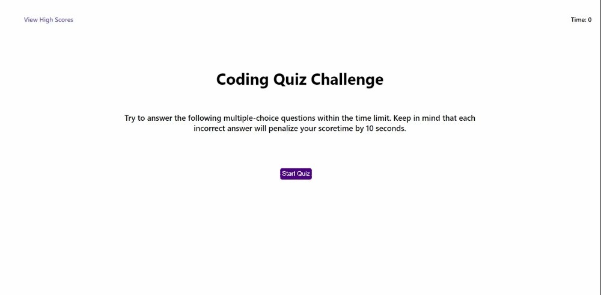

# 04chl-web-apis-code-quiz
Code Quiz

## Description

A timed coding quiz with multiple-choice questions on JavaScript fundamentals that stores high scores. This app will run in the browser and will feature dynamically updated HTML and CSS powered by JavaScript code that you write. 

## Installation

N/A

## Usage

After click on the start button, a timer starts and a question presented. 75 is the default maximum time. Click on one of the multiple-choice options to answer the question, after that another question will be presented. If a question is answered incorrectly, 10 seconds are subtracted from the clock. The game is over when all questions are answered or the timer reaches 0, then users can save their initials and scores. By click on the "View High Scores" link, users are able to see the list of scores sorted from high to low.

## Screenshot

The following image shows the web application's appearance and functionality:

## Link

[Deploy Link to the web application](https://m1xzo.github.io/04chl-web-apis-code-quiz/).

## Credits

N/A

## License

Please refer to the LICENSE in the repo.
